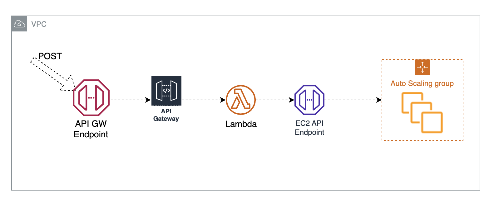

# Cold Standby Nodes

***

## Automation of Autoscaling Group Cold Standby Usecase

## Description
Launch and pre-configuration of EC2 instance can take several minutes in some scenarios. This could be a barrier for quick scale-out use cases where new compute resources need to be brought online in a short period of time. One way around it is to full pre-configure the EC2 instances and perform stop/power-off on them. However, if the instances are part of an Autoscaling Group, ASG health check will bring up new instances in order to fulfill the current desired capacity. ASG API allows for instances to be place in standby and decrement desired capacity thus not triggering creation of new instances by the healthcheck.

This repo automates the process of powering On/Off instances inside Autoscaling Group via a simple API call.

## Deployment Architecture

The Cloudformation template creates private API Gateway and Lambda Function with the required VPC API Gateway Endpoint and Endpoint security group.

### How to Use

To power Off all instances inside the given Autoscaling Group, invoke the API using POST method and pass in Autoscaling Group name as the argument. For example:

curl  --request POST https://XXXXXXXX.execute-api.us-east-1.amazonaws.com/prod/poweroff?AutoScalingGroupName=XXXXXXXXX

To power On all standby instances inside the given Autoscaling Group, invoke the API using POST method and pass in Autoscaling Group name as the argument. For example:

curl  --request POST https://XXXXXXXX.execute-api.us-east-1.amazonaws.com/prod/poweron?AutoScalingGroupName=XXXXXXXXX

### Automated Deployment procedure

Deploy using provided Cloudformation template.

## Security

See [CONTRIBUTING](CONTRIBUTING.md#security-issue-notifications) for more information.

## License

This library is licensed under the MIT-0 License. See the LICENSE file.

